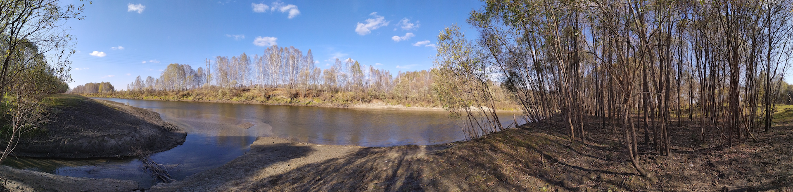

.. avli's notes documentation master file, created by
   sphinx-quickstart on Sun Jan 12 11:53:48 2020.
   You can adapt this file completely to your liking, but it should at least
   contain the root `toctree` directive.

avli's notes
============

Notes I make while doing stuff.

.. note:: Opinions are my own.

.. toctree::
   :maxdepth: 2
   :caption: Contents:

   java.rst
   python.rst
   archive.rst

Indices and tables
==================

* :ref:`genindex`
* :ref:`modindex`
* :ref:`search`
